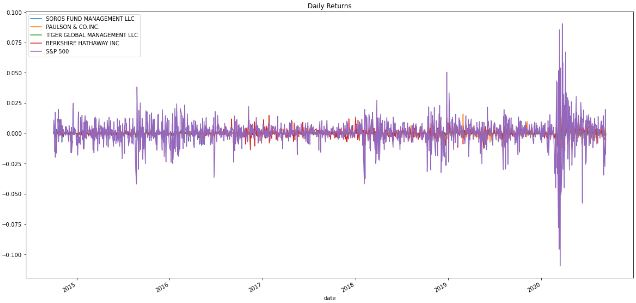
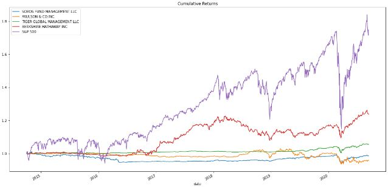
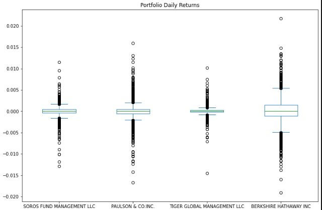
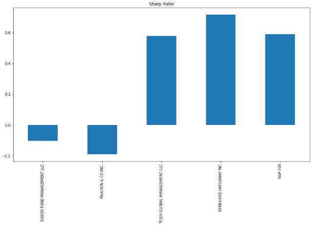

Module 4 Challenge

In this project, 4 investment options are analyzed alongside the S&P 500 in an effort to decide which would be the best new addition for a retirement portfolio.

Several markers are calculated in determining the overall best investment option, including annualized returns, beta averages, and sharp ratios.

---

## Technologies

This project uses Python 3.9.7 and the following libraries - 
| Library | Version | Documentation
|----|----|---|
| pandas |1.4.2| [pandas docs](https://pandas.pydata.org/docs)
| Numpy |1.22| [Numpy docs](https://numpy.org/doc/stable/)

---

## Installation Guide

Libraries can be imported as follows
```
import pandas as pd

import numpy as np
```
---

## Usage

A variety of information were gathered in this analysis.

|Daily Returns| Cumulative Returns|
|---|---|
|

|Box Plot|Sharp Ratio|
|---|---|
|

---

## Contributors

Dan McQueen

dandmcqueen@gmail.com

[Linkedin](https://www.linkedin.com/in/dan-mcqueen-4a5980238/)

---

## License

[GNU v3.0](LICENSE)